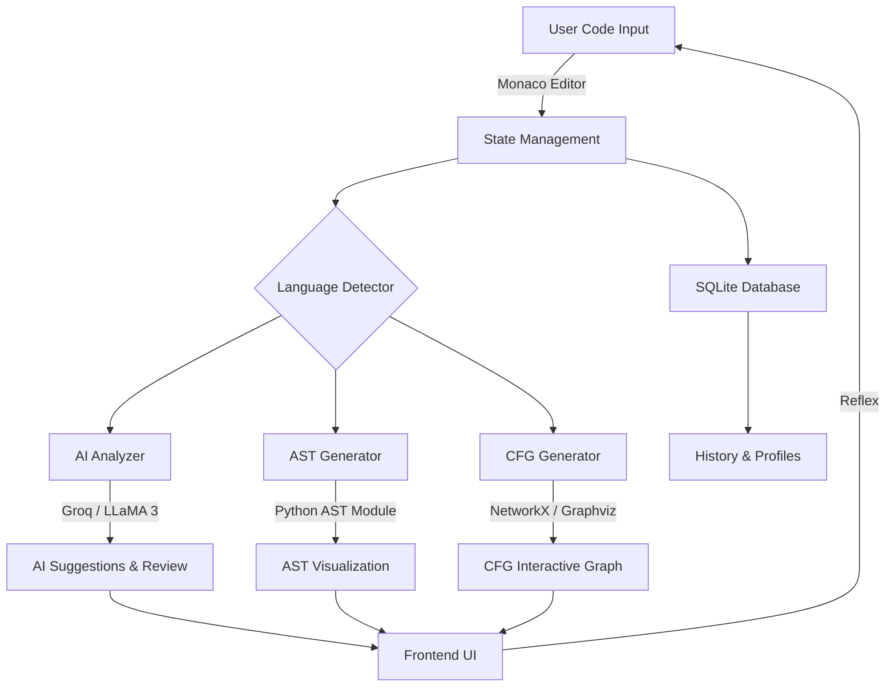

# 🧠 NeuralCompile: AI-Powered IDE & Code Visualizer

NeuralCompile is a next-generation, AI-driven integrated development environment (IDE) designed to streamline the process of writing, analyzing, and visualizing code. Built with the **Reflex** framework and powered by **LLMs**, it provides developers with deep insights into their code's structure and logic in real-time.

🚀 **Live Demo:** [https://neuralcompile-cyan-wood.reflex.run/](https://neuralcompile-cyan-wood.reflex.run/)

---

## ❓ Problem Statement

Modern software development often involves jumping between multiple tools to write code, debug errors, and understand complex logic structures like Abstract Syntax Trees (AST) or Control Flow Graphs (CFG). Traditional IDEs provide limited visual feedback on logic flow, and integrating AI assistance often requires manual context switching, leading to:
- Slower debugging cycles.
- Difficulty in understanding legacy or complex codebases.
- Lack of immediate, visual feedback on code logic.

## ✅ The Solution

NeuralCompile solves these challenges by providing an all-in-one platform that combines:
1.  **AI-Powered Intelligence**: Real-time code suggestions and deep-dive static analysis using LLaMA-based LLMs.
2.  **Advanced Visualization**: Instant generation of interactive ASTs and CFGs to help developers "see" their code’s logic.
3.  **Seamless Experience**: A VS Code-like editor (Monaco) integrated directly with powerful analysis tools.
4.  **Multi-Language Support**: Automatic detection and support for Python, JavaScript, C++, Java, and more.

---

## 🏗️ Architecture & Project Flow

NeuralCompile follows a modern full-stack Python architecture using the Reflex framework.

**Project Flow:**
1.  **Input**: The user enters code into the Monaco Editor.
2.  **Detection**: `multi_language_detector.py` automatically identifies the programming language.
3.  **Processing**: The backend triggers parallel processes for AI review (`ai_code_reviewer.py`), AST parsing (`ast_module.py`), and CFG generation (`cfg_generator.py`).
4.  **Analysis**: Insights are fetched from the Groq API using LLaMA 3 models.
5.  **Persistence**: All analyses and code snippets are stored in a local SQLite database for history tracking.
6.  **Visualization**: Interactive graphs are rendered on the frontend using Plotly and NetworkX.

---

## ✨ Key Features

- 🖊️ **Monaco Editor** — Professional-grade editor with syntax highlighting and autocompletion.
- 🤖 **AI Code Reviewer** — Intelligent detection of bugs, security vulnerabilities, and logic flaws.
- 🌳 **AST Viewer** — Interactive visualization of the Abstract Syntax Tree.
- 📊 **CFG Generator** — Visual representation of the program's control flow.
- 🔍 **Real-time Detection** — Automatic language identification as you type.
- 📜 **History Management** — Keep track of your previous sessions and analyses.
- 🌐 **Web-Based** — No installation required; run everything in your browser.

---

## 🛠️ Tech Stack

- **Frontend & Backend**: [Reflex](https://reflex.dev) (Full-stack Python Framework)
- **Editor**: Reflex-Monaco (VS Code Core)
- **AI Engine**: Groq (LLaMA 3 70B / 8B) via LangChain
- **Visualization**: Plotly, NetworkX, Graphviz
- **Database**: SQLite with SQLModel (ORM)
- **Parsing**: Python `ast`, Custom language parsers

---

## 📬 Contact & Support

For queries, bug reports, or future development collaborations:

👤 **Naveen Rondla**
- 🔗 **LinkedIn**: [Naveen Rondla](https://www.linkedin.com/in/naveen-rondla/)
- 📧 **Email**: [naveenrondla@hotmail.com](mailto:naveenrondla@hotmail.com)
- 🚀 **Portfolio/Demo**: [NeuralCompile Live](https://neuralcompile-cyan-wood.reflex.run/)

---
*Created with ❤️ by Naveen Rondla*
